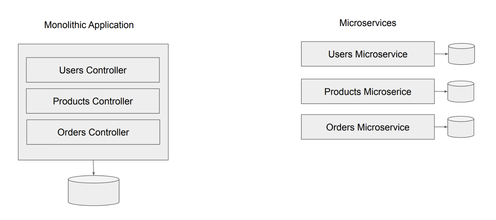
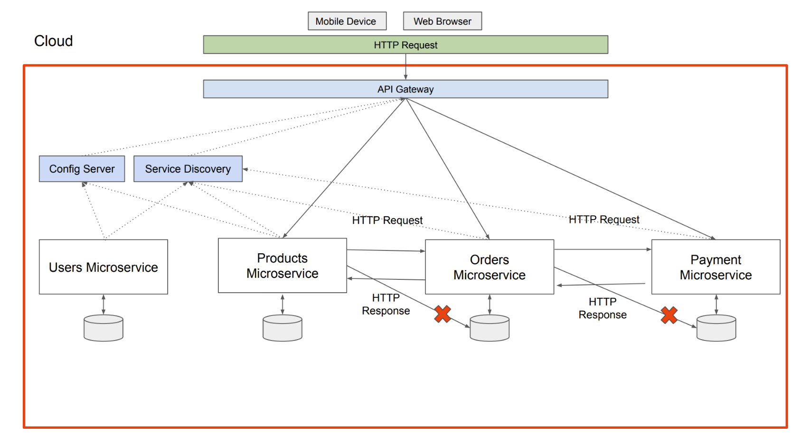
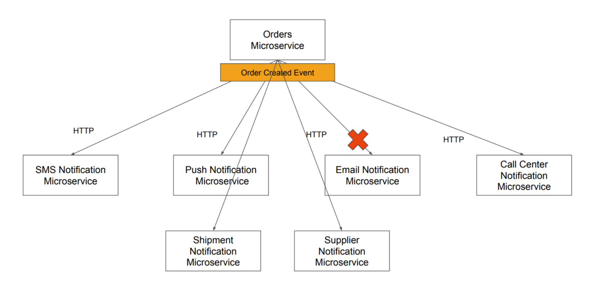
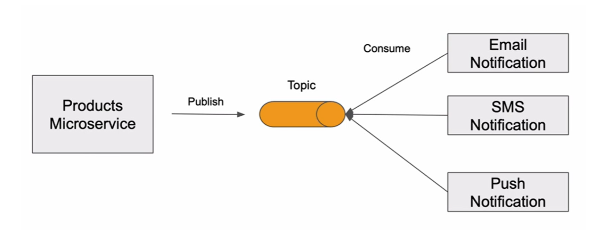
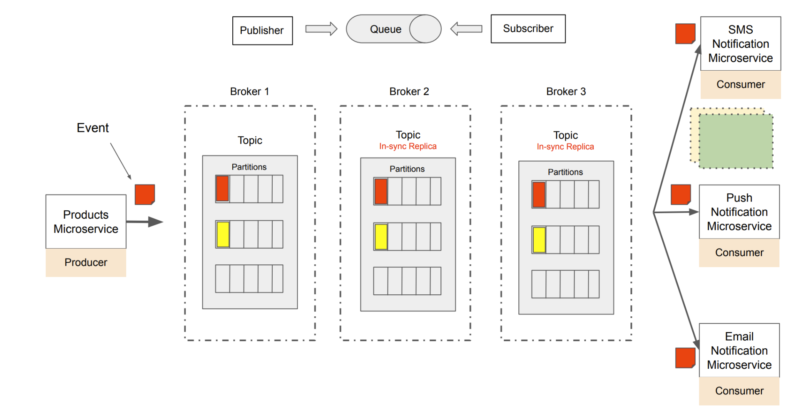
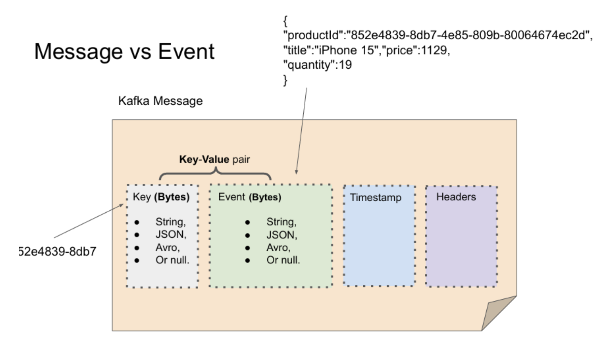
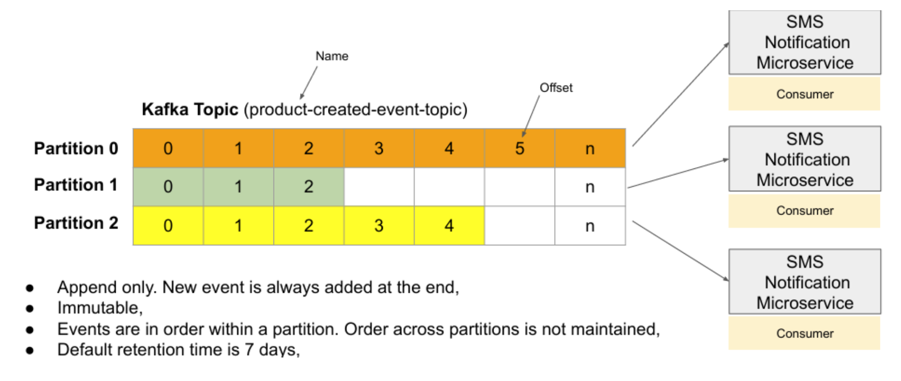

# [Section 1] Introduction to Apache Kafka

### What is Microservice? 

- Microservice is a very small, autonomous application that is usually designed to perform one specific business functionality.
    - 마이크로서비스는 하나의 특정 비즈니스적 기능을 수행하기 위해서 디자인된 매우 작고 자율적인 어플리케이션

- **micro**
    - 마이크로서비스 어플리케이션은 매우 작음 → 그래서 이름 앞에 micro가 붙은 것
    - 하나의 거대한 모놀리식 어플리케이션이 아니라, 여러 개의 작은 어플리케이션으로 split 해 놓은 구조

 

- `즉, 마이크로서비스는 다른 서비스에 의존하지 않고 독립적으로 배포될 수 있도록 디자인된 애플리케이션구조임`

 

- Microservices is Small, loosely coupled application that is usually designed to scale and work in the cloud.
    - 마이크로서비스는 작고, 느슨한 결합으로 이뤄진 어플리케이션임
    - 주로 scale in-out 할 수 있도록 클라우드 환경에서 구현됨

 

- 하나의 거대한 애플리케이션을 여러 개의 마이크로서비스로 나누는 것은 굉장히 도전적인 일임
    - 관리할 대상이 한 개에서 여러 개로 늘어나기 때문

 

- So to make our microservices scale up and down, to discover each other and to work in a group, microservices are usually configured to work in the cloud.
    - 이러한 스케일 인, 아웃 그리고 서로 연결하기 위해서 서로의 정보를 알아야 하고, 그룹으로 일하기 위해서 마이크로서비스는 클라우드 환경에서 주로 구현됨

 

- `Spring 프레임워크`가 마이크로서비스 아키텍쳐를 구현하기 위한 지원을 잘 해줌

 

### Microservice vs Monolithic application

- **Monolithic application**
    - controller가 여러 개인 하나의 큰 어플리케이션임 (spring 기준)
    - 한 부분을 고치더라도 전체를 다시 빌드하고 배포해야함
    - 하나의 데이터베이스에 모두 저장하는 방식

- **Microservice**
    - multiple smaller application
        - 하나가 아닌, 여러 개의 작은 어플리케이션들로 구성되어있음
    - `마이크로서비스 하나당 each DB`, 각각의 데이터베이스를 가지고 운영됨
        - 좀 더 느슨한 결합으로 이뤄질 수 있게 하고 
        - Scaleable 가능하게 하기 위함
    - 각각의 마이크로서비스는 독립적으로 나눠졌기 때문에 `서로가 통신하기 위한 방법이 필요`함

 

### Microservices Communication

 

 

- **대규모로 함께 작동하는 여러 마이크로서비스 애플리케이션**
    - 각 마이크로서비스는 `고유한 포트 번호에서 실행되는 작은 웹 서비스`
    - Moblie Device & Web Browser
        - 두 클라이언트 애플리케이션은 `모두 HTTP 요청을 전송하여 HTTP를 통해 웹 서비스와 통신`
    - 전체 빨간색 상자는 마이크로서비스를 지원하는 환경인 `Sprind Cloud`
    - **API GateWay**
        - 독립형 스프링 부트 애플리케이션
    - Config Server & Service Discovery
        - 특정 목적을 위해 만들어진 스프링 부트 애플리케이션
    
     

    - 만약,
        - Product가 Order의 정보를 필요로 할 때 직접 Order의 DB로 쿼리를 하지 않음
        - 직접적으로 쿼리하는 방식은 MSA에서 허용되지 않음
        - `대신, HTTP 요청을 보내서 응답을 받을 수 있음`
    - 마이크로서비스가 통신하는 방법 중 하나는 `HTTP 요청과 응답`

     

- **Direct Communication**
    - **동기식 HTTP**
        - 요청을 받으려고 하는 마이크로서비스에 대한 API 엔드포인트에 HTTP get 요청을 보냄
        - 응답으로 JSON 배열을 수신함

    - **비동기식 HTTP**
        - 요청을 받으려고 하는 마이크로서비스에 대한 API 엔드포인트에 HTTP post 요청을 보냄
        - `다만, 즉각적인 응답을 기다리지 않음`
        - 응답을 기다리지 않고 즉시 다음 작업을 계속해서 진행함
    - `둘 다 자주 쓰이지만 HTTP가 마이크로서비스 통신의 유일한 방법은 아님`

 

 

- Orders Microservice가 새로운 주문에 대한 사실을 다른 마이크로서비스한테 알려줘야하는 경우
    - 각 마이크로서비스가 정보를 수신하는지 확인하는 것은 매우 중요함
- **HTTP 요청을 이용하는 경우**
    - 그런데, Email 서비스가 잠시 중단되었다면 ?
        - 중단된 시간동안의 `HTTP 요청은 계속해서 손실됨`
    - 만약, 아래 두개의 마이크로서비스가 추가되었고 Order 서비스로부터 알림을 받길 원한다면
        - 직접 HTTP 통신을 작동하게 하려면 Order 마이크로서비스를 업데이트해야함
        - 이때, `Kafka와 Event driven communication`이 도움이 될 수 있음

 

### Event-Driven Architecture with Apache Kafka
- HTTP 요청과 응답을 이용한 통신
    - 많은 사례에 적용 가능하지만 전부를 커버할 수는 없음
- 한 마이크로서비스에서 동시에 여러 마이크로서비스에 요청을 보내야하는 경우
    - 적은 수의 서비스를 사용한다면 우리가 직접적으로 연결해주는 것도 방법이 될 수 있음
    - 하지만, 많은 수의 서비스를 일일히 연결해주기는 힘듦
        - 또 새로운 서비스가 추가된다면, 이 경우에도 일일히 연결해줘야함

 

- **이때, Apache Kafka와 Event-Driven 아키텍처가 위 문제점들을 해결해줄 수 있음**

- **전체 흐름**
    - 메세지를 여러 서비스에게 보내야하는 생산자는 `그저 카프카의 토픽으로 메세지를 개시`함
    - 이 메세지를 수신해야하는 서비스들은 `카프카의 토픽에서 개시된 메시지를 수신`함
        - 게시자가 메시지를 게시하자마자 구독한 모든 마이크로서비스들은 이 메시지를 수신하고 처리할 수 있음
    - `이런 흐름은 확장성이 매우 뛰어난 아키텍처임`

 

- **주의할 점**
    - 2가지 경우를 잘 생각해서 사용해야함
        - 간단하게 HTTP 요청과 응답으로 처리하는 경우
        - 이벤트 드리븐 아키텍처로 설계하는 경우
    `-> 간단한 요청의 경우 오히려 이벤트 드리븐 아키텍처가 비효율적일 수 있기 때문`

    - **Event-Driven은 대부분 비동기식이고 느슨하게 연결되어있음**
        - producer가 메시지를 개시했을 때 모든 consumer들이 메시지를 성공적으로 수신할 때까지 기다리지 않음
        - producer는 몇 개의 consumer가 있는지 인식할 수 없음
        - 또한 consumer들은 직접적으로 producer에게 응답을 보내지 않음
        - consumer 중 하나가 다운되어도 producer는 알 방법이 없음
            - 하지만, 다운되었다가 정상 상태로 돌아오면 놓친 이벤트를 계속 사용할 수 있음

 

### Apache Kafka for Microservices

 

- **Apache Kafka ?**
    - `Apache Kafka is distributed event streaming platform that is used to collect, process, store and integrate data at scale`
        - 대규모 데이터 수집, 처리, 저장, 통합을 위한 분산형 이벤트 스트리밍 플랫폼

 

- **Apache Kafka 사용 예시**

- **전체 흐름**
    - Producer가 이벤트를 개시
        - 이때, consumer는 동적으로 scale-in, out을 하면서 동작하겠지만
        - producer는 consumer가 몇 개가 동작하는지, ip 주소가 어떻게 되는지 알 수가 없음
        - producer는 `그저 이벤트(데이터)를 카프카의 Broker로 보냄`
            - 시스템의 안정성을 위해서 Broker는 여러 개로 동작
    - 이벤트를 받은 Broker는 Topic에 이벤트를 저장
        - 사실 Topic안에 여러 개의 partitions 중 하나에 저장됨
        - 저장되고 `카프카 클러스터 내의 다른 브로커의 토픽에 복제함`
    - 이벤트를 필요로 하는 Consumer들이 이벤트를 토픽에서 가져감
        - 이벤트는 파티션에 구분되어 저장되므로 consumer 들은 여러 이벤트들을 다른 파티션에서 병렬적으로 받아와서 처리 가능함
            - `많은 양의 데이터의 병렬처리`를 통해 속도 향상 가능

 

### Messages and Event in Apache Kafka

 

- **What is an Event ?**
    - 애플리케이션이나 시스템의 상태 변화를 뜻함
    - 즉, `애플리케이션에서 무언가 변경되었음을 의미`

 

- **Naming Convention**
    - 이벤트 이름은 단순 과거형이어야 함
    - 명사로 시작하고, 수행된 작업이 따르고 Event로 끝남
    ex) 새 제품이 생성되고 publish를 한다면, ProductCreatedEvent로 명명

 

- **Message vs Event**
    - **카프카 메시지**
        - 이벤트 데이터를 담고 있는 메시지 봉투라고 생각
    - **이벤트 데이터**
        - 메시지 봉투의 내용
        - String value, JSON payload 등 다양한 데이터 형태일 수 있음
        - 이벤트 객체에 어떤 정보를 포함할지 결정할 때 `카프카의 메시지는 네트워크를 통해 전송되는 것을 고려`해야함
            - 메세지 크기가 클수록 성능이 느려지기 때문
            - 이상적으로 이벤트에 필요한 모든 정보를 담아서 보내는 것이 좋지만, 이벤트 규모가 매우 커진다면 최적화를 고려해야 함
                - 만약, 이미지나 비디오 파일을 포함하려면 링크를 보내는 것이 좀 더 합리적임
        - 최종적으로 토픽에 Serialized되어 byte array 형태로 저장됨
        - consumer가 이벤트를 가져가면 deserialized하여 처리함
    - **메시지 키**
        - 키 값 또한 Null 값을 포함할 수 있으며 다양한 형태로 존재
        - 메시지 키의 유형과 관계없이 토픽에 저장되기 전에 프로듀서에 의해 직렬화되어서 array of bytes로 토픽에 저장됨
    - 따라서, `카프카 메시지를 키와 이벤트의 key-value 쌍 형태로 생각`할 수 있음
    - **타임 스탬프**
        - 이 값은 시스템에서 설정하거나 사용자 임의로 설정 가능함
        - 해당 Event가 언제 발행되었는지 알아야하기 때문에 중요
            - 이벤트의 순서나 시간적 흐름 관리 가능
    - **헤더**
        - 추가 메타데이터 정보를 포함하는데 사용할 수 있는 키-값 쌍 목록

 

### Kafka Topic and Partitions

 

- **Topic**
    - `카프카가 메시지를 저장하는 공간`
    - 토픽은 파티션들로 구성되고, 파티션들은 클러스터 내 다른 브로커에 복제됨
        - 한 서버에 장애가 나더라도 다른 서버에 있는 토픽에 데이터가 살아있음
    - 토픽의 이름은 unique함
    - 카프카 토픽은 `append only 구조`임
    - 한번 저장된 이벤트는 immutable 함
    - change, update, delete 불가
    - **Parition**
        - 토픽은 여러 개의 파티션으로 구성됨
            - 여러 개의 파티션으로 나눠서 구성되어 있어 consumer가 병렬적으로 메시지 가져갈 수 있음
            - 같은 일을 처리하는 여러 마이크로서비스를 만들어서 각 파티션에 연결(pub-sub) 해놓으면 task를 분산처리 가능
            - 성능 향상 가능, 쉬운 scale-out 가능
        - 몇 개의 파티션으로 구성할지는 토픽을 생성할 때 지정 가능
            - 토픽을 구성한 후에도 파티션 증가는 가능
        - 카프카 서버의 하드 디스크에 데이터가 저장됨
    - **Offset**
        - 파티션 내의 여러 셀의 번호
        - index와 비슷한 개념으로 0번 부터 시작
        - 새로운 이벤트는 항상 끝 오프셋에 저장됨 (중간에 끼워넣기 불가)

    - **Retention Time**
        - 소비된 이벤트도 바로 삭제되지 않고 토픽에 그대로 남아있음
        - 카프카의 기본 값은 7일 저장이고, 원한다면 변경 가능

 

### Ordering Events in Apache Kafka

 

- **Kafka Topic에 이벤트가 저장되는 순서**
    - 카프카 메시지는 `message key - message value 형태`로 이루어져있음
    - 만약, 메시지 키가 주어지지 않는다면 토픽의 아무 파티션에 저장될 수 있음
        - 이렇게 저장했을 때(메시지 키 없이), 사용자는 a, b, c 순서대로 업데이트를 했는데, consumer가 병렬적으로 파티션에서 가져가면서 a, c, b 순서대로 처리할 가능성이 존재함
    - 이런 문제점이 없게하기 위해 `우리는 메시지 키를 항상 제공해야함`
    - 같은 메시지 키를 가졌다면 같은 파티션에 항상 저장이 되기 때문에 순차적으로 처리 가능
    - `즉, 관련된 내용들은 동일한 메시지 키를 이용해서 같은 파티션에 넣어서 순차적으로 처리하자`