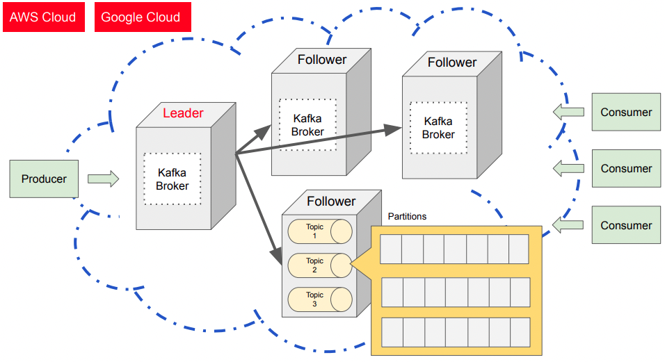

# [Section 1] Apache Kafka Broker

 

### What is Apache Kafka Broker ?

 

- **Broker**
    - `카프카 프로세스를 실행하는 카프카 서버`라고 생각
    - 항상 실행 가능하게 하고 고가용성을 유지하기 위해서 여러 개의 브로커로 클러스터를 구성
        - 하나의 브로커에서 장애가 나더라도, 나머지 브로커가 일을 계속해서 처리해줌
    - 데이터 저장의 신뢰성을 보장하기 위해서 여러 브로커들을 클러스터 형태로 묶어 사용
        - `하나의 브로커가 리더 역할을 할 것이고, 나머지가 팔로워 역할을 함`
        - 리더 브로커에서 read and write request가 일어나고, 팔로워 브로커들은 이를 복제하여 저장함
        - `리더는 고정되어있지 않음`
            - 리더를 맡고 있는 브로커에 장애가 생기면, 팔로워 중 하나가 리더 역할을 대신함
    - 하나의 브로커에서 여러 토픽을 운영하고,
        - 토픽 내에서도 여러 개의 파티션들을 운영함
    - **즉, Broker는 producer로부터 데이터를 받아서 토픽에 저장하고 복제하며 consumer로 부터 토픽에서 데이터를 가져갈 수 있도록 handling함**

 

### Apache Kafka Broker: Leader and Follower roles

 

- **Leader**
    - A leader is responsible for handling all read and write requests for partitions in a topic.
        - 리더는 토픽의 파티션에 오는 모든 읽기, 쓰기 요청을 핸들링할 책임이 있음
    - 프로듀서에 의해 메시지가 리더 브로커의 파티션에 잘 저장이 되면 팔로워 브로커의 파티션에 복제해놓음
        - 만약 팔로워 브로커에도 쓰기를 허용한다면 데이터 일관성이 깨지고 충돌날 수 있음
        - 다른 팔로워가 다른 버전의 데이터를 가지고 있을 수 있기 때문

 

- **follower**
    - A follower in Kafka is a replica of partition
        - 팔로워 브로커는 파티션의 복제본임
        - 리더가 어떤 데이터를 가지고있던 리더의 모든 데이터를 복제함
    - redundancy and fault tolerance
        - 중복성, 고가용성을 가짐
    - 리더 역할이 고장나면 팔로워 중 하나가 리더 역할을 대신함
        - 클러스터 형태가 아닌 단일 Broker로 사용한다면 이 리더 브로커가 고장나면 전체 시스템이 중단되는 것임
        - 클러스터 형태로 사용해야 데이터를 보장할 수 있음
    - 카프카 클러스터를 수평적으로 scale-out 가능하게 해줌
        - 팔로워 브로커들을 여러개 둠으로써 데이터의 중복성을 향상시킬 수 있고 데이터 처리 성능 또한 향상 가능

 

- **하나의 브로커만 항상 리더를 한다면 bottleneck이 일어날 수 있음**
    - 해당 브로커에서만 read, write request가 일어나기 때문
    - To avoid bottleneck
        - 모든 브로커는 동시에 리더 역할을 할수도, 팔로워 역할을 할수도 있음
        - 토픽이 생성될 때 파티션 마다 leader broker와 follower broker가 할당됨
        즉, 파티션마다 leader 역할을 하는 브로커가 다름
    - 만약, 리더 역할을 하는 브로커에 장애가 생겼다면 파티션은 다른 리더를 재할당함

 

### 